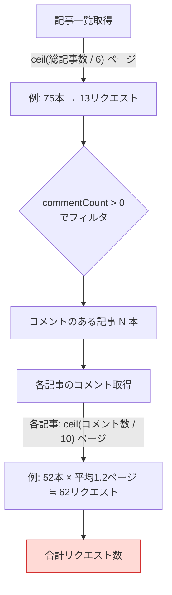
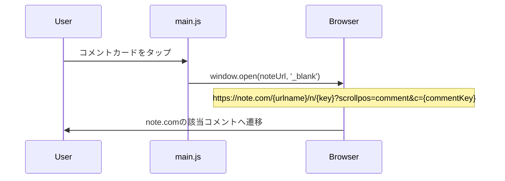
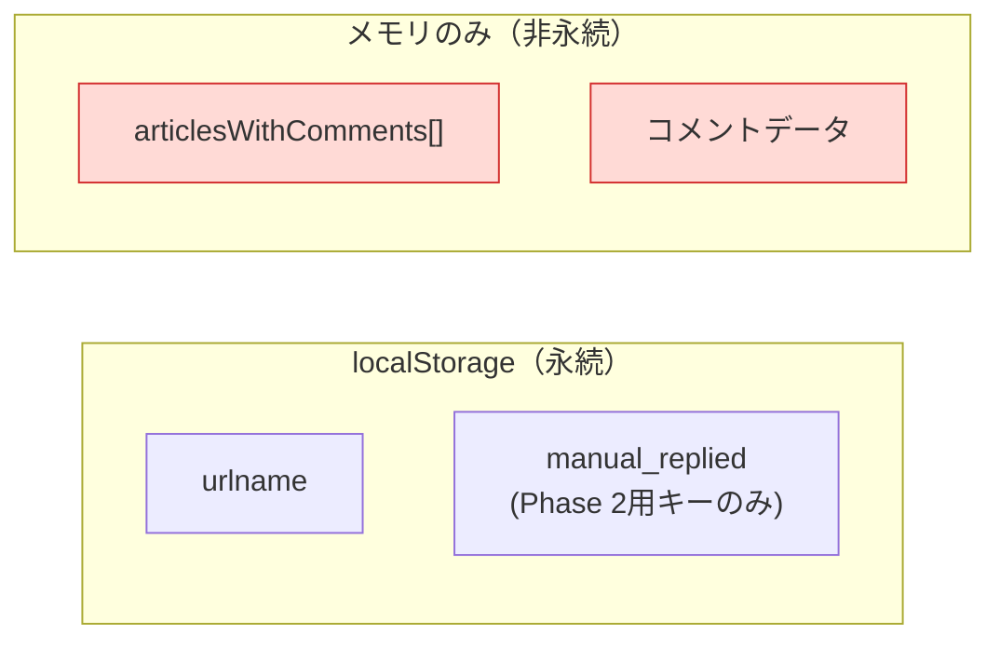

# 処理シーケンス図

## 起動〜データ表示

```mermaid
sequenceDiagram
    participant User
    participant main.js
    participant storage.js
    participant api.js
    participant Proxy as CF Worker Proxy
    participant Note as note.com API

    User->>main.js: ページ読み込み
    main.js->>storage.js: getUrlname()

    alt urlnameなし
        main.js->>User: 設定モーダル表示
        User->>main.js: urlname入力 → 保存
        main.js->>storage.js: setUrlname(urlname)
    end

    main.js->>main.js: refresh() 開始
    Note over main.js: loading表示, content非表示

    %% 記事一覧取得（ページネーション）
    loop 各ページ (6件/ページ固定, per_page指定不可)
        main.js->>api.js: fetchAllArticles(urlname)
        api.js->>Proxy: GET ?path=/api/v2/creators/{urlname}/contents?kind=note&page={n}
        Proxy->>Note: GET /api/v2/creators/{urlname}/contents?kind=note&page={n}
        Note-->>Proxy: {data: {contents: [最大6件], isLastPage}}
        Proxy-->>api.js: レスポンス中継
        api.js->>api.js: commentCount > 0 の記事をフィルタ
        api.js->>main.js: onProgress("記事一覧を取得中...")
        Note over api.js: sleep(500ms) ※次ページがある場合
    end

    api.js-->>main.js: articles[] (コメントのある記事のみ)

    %% 各記事のコメント取得（逐次）
    loop 各記事 (1〜N本)
        main.js->>api.js: fetchComments(noteKey)
        loop 各ページ (10件/ページ)
            api.js->>Proxy: GET ?path=/api/v3/notes/{key}/note_comments?per_page=10&page={n}
            Proxy->>Note: GET /api/v3/notes/{key}/note_comments?per_page=10&page={n}
            Note-->>Proxy: {data: [...], next_page, total_count}
            Proxy-->>api.js: レスポンス中継
            Note over api.js: sleep(300ms) ※次ページがある場合
        end
        api.js-->>main.js: comments[]
        main.js->>main.js: onProgress("コメント取得中... (i/N)")
        Note over api.js: sleep(300ms) ※次記事がある場合
    end

    main.js->>main.js: processComments() - 自分除外, ステータス分類, ソート
    main.js->>main.js: render() - DOM構築
    Note over main.js: loading非表示, content表示
    main.js->>User: コメント一覧表示
```

## APIリクエスト回数の見積もり



### 具体例（hasyamo の場合）

| フェーズ | 計算 | リクエスト数 | sleep合計 |
|---------|------|------------|----------|
| 記事一覧 | 75本 ÷ 6件/ページ = 13ページ | **13回** | 12 × 500ms = **6秒** |
| コメント取得 | 52記事 × 平均1.2ページ | **≒62回** | 52 × 300ms + ページ内300ms = **≒18秒** |
| **合計** | | **≒75回** | **≒24秒** |

> ※ 記事数が多いクリエイターほどリクエスト数・待ち時間が線形に増加する。
> 現状は毎回全件再取得のため、キャッシュ（Phase 2）で大幅に改善可能。

## コメントタップ〜ディープリンク



## データの永続化状況


